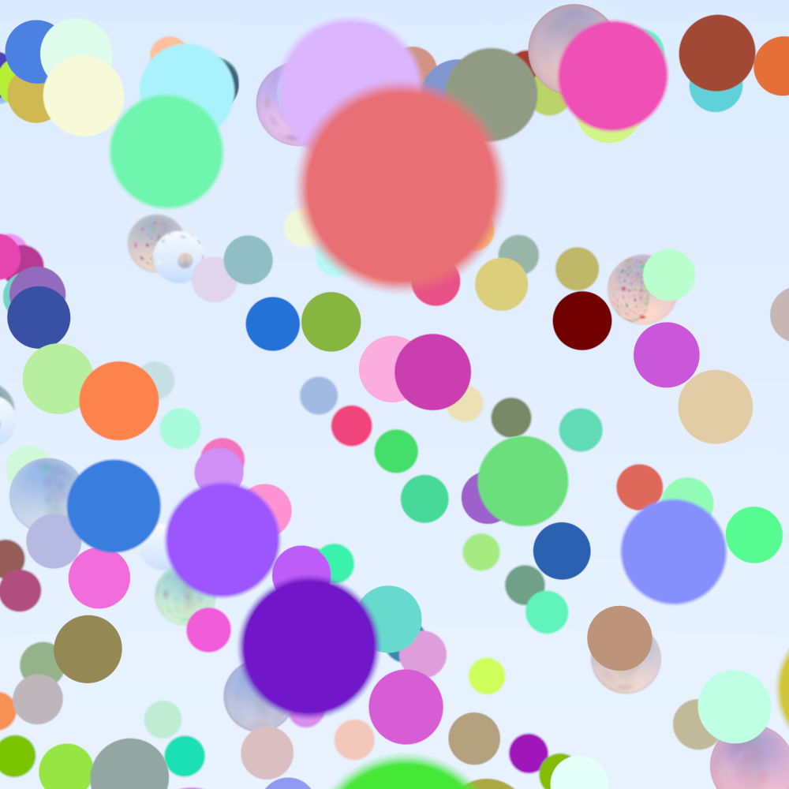
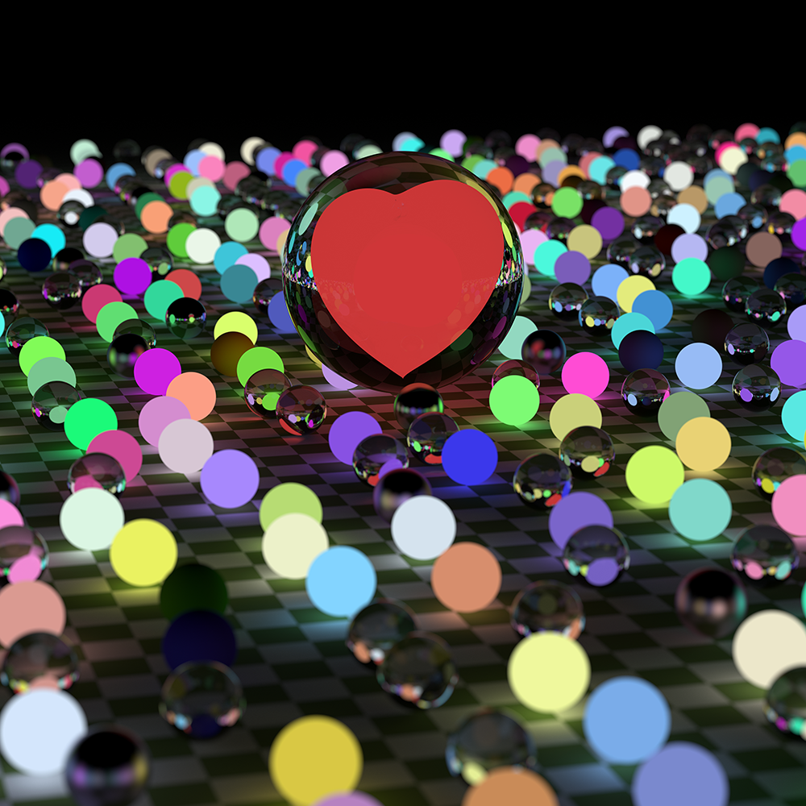

# RayTracer

Reference: [_Ray Tracing The Next Week_](https://github.com/RayTracing/raytracing.github.io/)

[TOC]

#### 主要模块

| Name           |                             |
| -------------- | --------------------------- |
| Vec3           | 三维向量                    |
| Ray            | 直线                        |
| Hittable       | 可碰撞抽象基类              |
| FlipFace       | flip normal                 |
| Sphere         | 球                          |
| MovingSphere   |                             |
| HittableList   |                             |
| AABB           | Axis-Aligned Bounding Boxes |
| BVH            |                             |
| AARect         | Axis-Aligned rect           |
| Box            |                             |
| ConstantMedium |                             |
| Camera         |                             |
| Material       | 材质抽象基类                |
| Lambertian     | diffuse                     |
| Metal          | mirrored reflect            |
| Dielectric     | refract                     |
| Isotropic      |                             |
| Texture        | 纹理抽象基类                |
| SolidColor     |                             |
| CheckerTexture |                             |
| NoiseTexture   |                             |
| IMGTexture     |                             |
| Perlin         |                             |

#### 1. Motion Blur

> In a real camera, the shutter opens and stays open for a time interval, and the camera and objects may move during that time. Its really an average of what the camera sees over that interval that we want.

#### 2. Bounding Volume Hierarchies

> **Idea** 
>
> A key thing is we are dividing objects into subsets. We are not dividing the screen or the volume. Any object is in just one bounding volume, but bounding volumes can overlap.

> - Axis-Aligned Bounding Boxes
>
> $$
> t_x\cap t_y \cap t_z \neq \phi
> $$
>
> `NaN` should be take care of.

> - BVH Node
>
> Note that the children pointers are to generic hittables. They can be other BVHnodes, or spheres, or any other hittable. A brilliant trick.
>
> - Splitting BVH Volumes
>
> 1. randomly choose an axis
> 2. sort the primitives (`using std::sort`)
> 3. put half in each subtree
>
> When the list coming in is two elements, I put one in each subtree and end the recursion. The traversal algorithm should be smooth and not have to check for null pointers, so if I just have one element I duplicate it in each subtree.
>
> The check for whether there is a bounding box at all is in case you sent in something like an infinite plane that doesn’t have a bounding box.

#### 3. Solid Textures

> - spherical coordinates
>
>   `another version`
>
> 
> $$
> u = \frac{\theta+\pi}{2\pi}
> $$
>
> $$
> v = \frac{\varphi}{\pi}
> $$
>
> - Checker Texture
>
> We can create a checker texture by noting that the sign of sine and cosine just alternates in a regular way, and if we multiply trig functions in all three dimensions, the sign of that product forms a 3D checker pattern.

#### 4. Perlin Noise

> - Smoothing out the Result
>
>   linearly interpolate
>
> - Hermitian Smoothing
>
>   use a Hermite cubic to round off the interpolation
>
> - Tweaking The Frequency
>
> - Using Random Vectors on the Lattice Points
>
>   use a dot product to move the min and max off the lattice
>
> - Turbulence
>
>   a composite noise that has multiple summed frequencies
>
>   The basic idea is to make color proportional to something like a sine function, and use turbulence to adjust the phase (so it shifts x in sin(x)) which makes the stripes undulate.

#### 5. Image Texture Mapping

> $$
> u = \frac{i}{N_x-1}
> $$
>
> $$
> v = \frac{j}{N_y-1}
> $$
>
> **Note**
>
> image_data is left upper corner.
>
> $\theta=-\pi /2 \rightarrow u=0 $

#### 6. Rectangles and Lights

#### 7. Instances

>  instead we move the rays in the opposite direction

> Unlike the situation with translations, the surface normal vector also changes, so we need to transform directions too if we get a hit.

#### 8. Volumes

- [ ] It's possible to write an implementation that handles arbitrary shapes, but we'll leave that as an exercise for the reader.

$$
\mathrm{d}N=-C\cdot \mathrm{d}L
$$

$$
\Rightarrow Pro=e^{-CL}
$$

> where $C$ is proportional to the optical density of the volume

> The reason we have to be so careful about the logic around the boundary is we need to make sure this works for ray origins inside the volume. 
>
> In addition, the above code assumes that once a ray exits the constant medium boundary, it will continue forever outside the boundary. Put another way, it assumes that the boundary shape is convex. So this particular implementation will work for boundaries like boxes or spheres, but will not work with toruses or shapes that contain voids.

#### 9. A Scene Testing All New Features

> The biggest limitation left in the renderer is no shadow rays, but that is why we get caustics and subsurface for free. It’s a double-edged design decision.