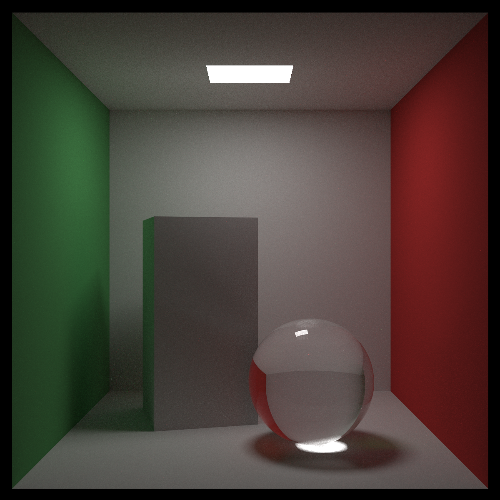

# RayTracer

Reference: [_Ray Tracing The Rest of Your Life_](https://github.com/RayTracing/raytracing.github.io/)

[TOC]

#### 1. A Simple Monte Carlo Program

> Interestingly, the stratified method is not only better, it converges with a better asymptotic rate! Unfortunately, this advantage decreases with the dimension of the problem (so for example, with the 3D sphere volume version the gap would be less). This is called the *Curse of Dimensionality*.

#### 2. One Dimensional MC Integration

Reference: [link](https://zhuanlan.zhihu.com/p/146144853)

#### 3. MC Integration on the Sphere of Directions

#### 4. Light Scattering

> - Albedo
>
>   Probability of light scattering: A
>
>   Probability of light being absorbed: 1 - A
>
> - Scattering
>   $$
>   B R D F=\frac{A \cdot s(\text {direction})}{\cos (\theta)}
>   $$

#### 5. Importance Sampling Materials

> Our goal over the next two chapters is to instrument our program to send a bunch of extra rays toward light sources so that our picture is less noisy.
>
> For example, the simplest would be:
> $$
> p(\text {direction})=\frac{1}{2} \cdot \operatorname{Light}(\text {direction})+\frac{1}{2} \cdot \operatorname{pSurface}(\text {direction})
> $$
> 
> As long as the weights are positive and add up to one, any such mixture of PDFs is a PDF. Remember, we can use any PDF: *all PDFs eventually converge to the correct answer*. So, the game is to figure out how to make the PDF larger where the product `s(direction) * color(direction)` is large.

#### 6. Generating Random Directions

> - Random points on the unit sphere
>
>   We will only deal with distributions that are rotationally symmetric about z. So $p(direction)=f(\theta)$.
>   $$
>   \begin{gathered}
>   a(\phi)=\frac{1}{2 \pi} \\
>   b(\theta)=2 \pi f(\theta) \sin (\theta)
>   \end{gathered}
>   $$
>   In uniform case,
>   $$
>   \phi=2\pi \cdot r_1 \\
>      \cos(\theta)=1-2r_2
>   $$
>   
>   $$
>   \begin{gathered}
>     x=\cos (\phi) \cdot \sin (\theta) \\
>     y=\sin (\phi) \cdot \sin (\theta) \\
>     z=\cos (\theta)
>     \end{gathered}
>   $$
>

#### 7. Orthonormal Bases

> Suppose we have any vector $\mathbf{a}$ that is of nonzero length and not parallel to $\mathbf{n}$.
> $$
> \begin{gathered}
> \mathbf{t}=\text {unitvector}(\mathbf{a} \times \mathbf{n}) \\
> \mathbf{s}=\mathbf{t} \times \mathbf{n}
> \end{gathered}
> $$

#### 8. Sampling Lights Directly

For a light of area $A$, if we sample uniformly on that light, the PDF on the surface of the light is $\frac{1}{A}$. What is it on the area of the unit sphere that defines directions? Fortunately, there is a simple correspondence, as outlined in the diagram:

If we look at a small area $d A$ on the light, the probability of sampling it is $p_{q}(q) \cdot d A$. On the sphere, the probability of sampling the small area $d w$ on the sphere is $p(direction) \cdot d w$. There is a geometric relationship between $d w$ and $d A$ :
$$
d w=\frac{d A \cdot \cos (\text {alpha})}{d i s t a n c e^{2}(p, q)}
$$
Since the probability of sampling $d w$ and $d A$ must be the same, we have
$$
p(\text {direction}) \cdot \frac{d A \cdot \cos (\text {alpha})}{\text {distance}^{2}(p, q)}=p_{q}(q) \cdot d A=\frac{d A}{A}
$$
So
$$
p(\text {direction})=\frac{\text {distance}^{2}(p, q)}{\cos (\text {alpha}) \cdot A}
$$

#### 9. Mixture Densities

$$
\text {mixture}_{\text {pdf}}(\text {direction})=\frac{1}{2} \text { reflection}_{\text {pdf}}(\text {direction})+\frac{1}{2} \operatorname{light}_{\mathrm{pdf}}(\text {direction})
$$

> If we step back a bit, we see that there are two functions a PDF needs to support:
>
> 1. What is your value at this location?
> 2. Return a random number that is distributed appropriately.

#### 10. Some Architectural Decisions

> There are some other issues with the code.
>
> The PDF construction is hard coded in the `ray_color()` function. We should clean that up, probably by passing something into color about the lights. Unlike BVH construction, we should be careful about memory leaks as there are an unbounded number of samples.
>
> The specular rays (glass and metal) are no longer supported. The math would work out if we just made their scattering function a delta function. But that would be floating point disaster. We could either separate out specular reflections, or have surface roughness never be zero and have almost-mirrors that look perfectly smooth but don’t generate NaNs. I don’t have an opinion on which way to do it (I have tried both and they both have their advantages), but we have smooth metal and glass code anyway, so I add perfect specular surfaces that do not do explicit f()/p() calculations.
>
> We also lack a real background function infrastructure in case we want to add an environment map or more interesting functional background. Some environment maps are HDR (the RGB components are floats rather than 0–255 bytes usually interpreted as 0-1). Our output has been HDR all along; we’ve just been truncating it.
>
> Finally, our renderer is RGB and a more physically based one — like an automobile manufacturer might use — would probably need to use spectral colors and maybe even polarization. For a movie renderer, you would probably want RGB. You can make a hybrid renderer that has both modes, but that is of course harder. I’m going to stick to RGB for now, but I will revisit this near the end of the book.

#### 11. Cleaning Up PDF Management

> So far I have the `ray_color()` function create two hard-coded PDFs:
>
> 1. `p0()` related to the shape of the light
> 2. `p1()` related to the normal vector and type of surface
>
> We can pass information about the light (or whatever `hittable` we want to sample) into the `ray_color()` function, and we can ask the `material` function for a PDF (we would have to instrument it to do that). We can also either ask `hit` function or the `material` class to supply whether there is a specular vector.
>
> - Sampling a Sphere Object
>
>   When we sample a sphere’s solid angle uniformly from a point outside the sphere, we are really just sampling a cone uniformly (the cone is tangent to the sphere).

We also need to evaluate the PDF of directions. For directions toward the sphere this is 1/solid_angle. What is the solid angle of the sphere? It has something to do with the $C$ above. It, by definition, is the area on the unit sphere, so the integral is
$$
\text {solid angle}=\int_{0}^{2 \pi} \int_{0}^{\theta_{\max }} \sin (\theta)=2 \pi \cdot\left(1-\cos \left(\theta_{\max }\right)\right)
$$
