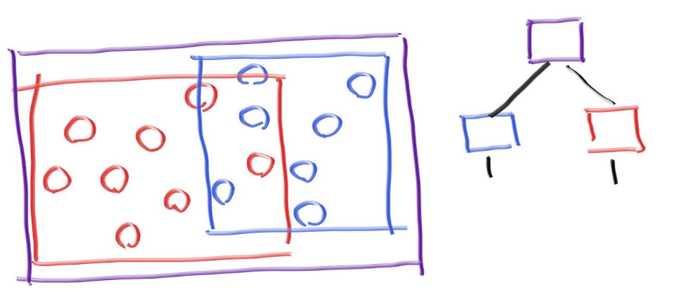

# RayTracer

code for [RayTracingInOneWeekend](https://github.com/RayTracing/raytracing.github.io/)

~~第一次用vscode格式化C++代码，真香~~

|      |          |      |
| ---- | -------- | ---- |
| Vec3 | 三维向量 |      |
|      |          |      |
|      |          |      |

#### 1.First PPM image

#### 2.A blue-to-white gradient depending on ray Y coordinate

​	Also, Rendering a red sphere

#### 3.Rendering surface normals on a sphere

> A common trick used for visualizing normals (because it’s easy and somewhat intuitive to assume $\vec{n}$ is a unit length vector — so each component is between −1 and 1) is to map each component to the interval from 0 to 1, and then map x/y/z to r/g/b.

#### 4.An Abstraction for Hittable Objects

>Most ray tracers have found it convenient to add a valid interval for hits $t_{min}$ to $t_{max}$, so the hit only “counts” if $t_{min}<t<t_{max}$.