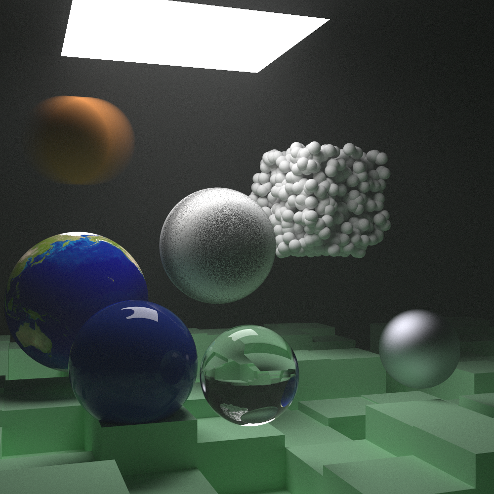

# RayTracer

Reference: [_Ray Tracing In One Weekend_](https://github.com/RayTracing/raytracing.github.io/)



[TOC]

#### C11/14/17的一些feature

- `override`：继承时标识 for virtual function

- `Initiallizer list`

    ```c++
    std::vector<int> v{1, 2, 3};	//quite easy
    ```

- `nullptr`

- `auto/for`

    ```c++
    for (auto i : vec)	//read only
    for (const auto& i : vec)	//read only
    for (auto& i : vec)	//changeable
    ```

- `delete`

    ```c++
    fun1(int a)
    fun1(double) = delete;	//not allowed
    ```

- `smart pointer`

  1. `shared_ptr`

  > Every time you assign its value to another shared pointer (usually with a simple assignment), the reference count is incremented. As shared pointers go out of scope (like at the end of a block or function), the reference count is decremented. Once the count goes to zero, the object is deleted.
  >
  > It makes memory management automatic.
  >
  > `std::shared_ptr` is included with the ` <memory>` header.

  ```c++
  auto double_ptr = make_shared<double>(0.37);
  auto vec3_ptr   = make_shared<vec3>(1.414214, 2.718281, 1.618034);
  auto sphere_ptr = make_shared<sphere>(point3(0,0,0), 1.0);
  ```

  > use_count 返回引用计数的个数
  > unique 返回是否是独占所有权( use_count 为 1)
  > swap 交换两个 shared_ptr 对象(即交换所拥有的对象)
  > reset 放弃内部对象的所有权或拥有对象的变更, 会引起原有对象的引用计数的减少
  > get 返回内部对象(指针), 由于已经重载了()方法, 因此和直接使用对象是一样的
  
  2. `weak_ptr`

  > weak_ptr是用来解决shared_ptr相互引用时的死锁问题，如果说两个shared_ptr相互引用，那么这两个指针的引用计数永远不可能下降为0，资源永远不会释放。
  >
  > 它是对对象的一种弱引用，不会增加对象的引用计数，和shared_ptr之间可以相互转化，shared_ptr可以直接赋值给它，它可以通过调用lock函数来获得shared_ptr。
  >
  > ```c++
  > void fun()
  > {
  > 	shared_ptr<B> pb(new B());
  > 	shared_ptr<A> pa(new A());
  > 	cout << pb.use_count() << endl;	//1
  > 	cout << pa.use_count() << endl;	//1
  > 	pb->pa_ = pa;
  > 	pa->pb_ = pb;
  > 	cout << pb.use_count() << endl;	//2
  > 	cout << pa.use_count() << endl;	//2
  > }
  > ```
  >
  > 可以看到fun函数中pa ，pb之间互相引用，两个资源的引用计数为2，当要跳出函数时，智能指针pa，pb析构时两个资源引用计数会减1，但是两者引用计数还是为1。
  >
  > 如果把其中一个改为weak_ptr就可以了，我们把类A里面的shared\_ptr pb\_，改为weak_ptr pb\_ 
  >
  > ```c++
  > 1
  > 1
  > 1
  > 2
  > B delete
  > A delete
  > ```
  >
  > 注意：我们不能通过weak_ptr直接访问对象的方法
  >
  > weak_ptr 没有重载*和->但可以使用 lock 获得一个可用的 shared_ptr 对象。注意，weak_ptr 在使用前需要检查合法性，expired 用于检测所管理的对象是否已经释放。lock 用于获取所管理的对象的强引用(shared_ptr)。 如果 expired 为 true，返回一个空的 shared_ptr; 否则返回一个 shared_ptr，其内部对象指向与 weak_ptr 相同。
  >
  > weak_ptr 支持拷贝或赋值，但不会影响对应的 shared_ptr 内部对象的计数。
  
  3. `unique_ptr`


#### 主要模块

| name         |                  | members                                     |
| ------------ | ---------------- | ------------------------------------------- |
| Vec3         | 三维向量         | (x,y,z)                                     |
| Ray          | 直线             | $\mathbf{P}(t) = \mathbf{A} + t \mathbf{b}$ |
| Hittable     | 可碰撞抽象基类   | hit                                         |
| Sphere       | 球               | c&r,hit(Ray,self)                           |
| HittableList |                  |                                             |
| Camera       |                  | orig/LDcorner/vertical/horiontal...         |
| Material     | 材质抽象基类     | produce scattered ray                       |
| Lambertian   | diffuse          |                                             |
| Metal        | mirrored reflect |                                             |
| Dielectric   | refract          |                                             |


#### 1. First PPM image


**Note**

1. The pixels are written out in rows with pixels left to right.
2. The rows are written out from top to bottom.

#### 2. A blue-to-white gradient depending on ray Y coordinate


#### 3. Rendering surface normals on a sphere

when a ray hits a sphere,
$$
(\mathbf{P} - \mathbf{C}) \cdot (\mathbf{P} - \mathbf{C}) = r^2
$$

$$
t^2 \mathbf{b} \cdot \mathbf{b}
     + 2t \mathbf{b} \cdot (\mathbf{A}-\mathbf{C})
     + (\mathbf{A}-\mathbf{C}) \cdot (\mathbf{A}-\mathbf{C}) - r^2 = 0
$$

> A common trick used for visualizing normals (because it’s easy and somewhat intuitive to assume $\vec{n}$ is a unit length vector — so each component is between −1 and 1) is to map each component to the interval from 0 to 1, and then map x/y/z to r/g/b.

#### 4. An Abstraction for Hittable Objects

>Most ray tracers have found it convenient to add a valid interval for hits $t_{min}$ to $t_{max}$, so the hit only “counts” if $t_{min}<t<t_{max}$.

#### 5. Front Faces Versus Back Faces&A List of Hittable Objects


> If the ray and the normal face in the same direction, the ray is inside the object. 
>
> This can be determined by taking the dot product of the two vectors, where if their dot is positive, the ray is inside the sphere.

#### 6. Antialiasing

> When a real camera takes a picture, there are usually no jaggies along edges because the edge pixels are a blend of some foreground and some background. We can get the same effect by averaging a bunch of samples inside each pixel.


#### 7. Diffuse Materials

> Light that reflects off a diffuse surface has its direction randomized.


> **A simple algorithm**
>
> The sphere with a center at $(\mathbf{P} - \mathbf{n})$ is considered inside the surface, whereas the sphere with center  $(\mathbf{P} + \mathbf{n})$ is considered outside the surface. Select the tangent unit radius sphere that is on the same side of the surface as the ray origin. 
>
> Pick a random point $\mathbf{S}$ inside this unit radius sphere and send a ray from the hit point  $\mathbf{P}$ to the random point  $\mathbf{S}$


> **Note**
>
> Make `ray_color` recursive to handle more than one diffuse reflections, while limit the maximum recursion depth.(It's brilliant!)
>
> **Gamma correction**
>$$
> V_{out}=A \cdot V_{in}^{\gamma}
> $$
> 
>**True Lambertian Reflection**
> 
>True Lambertian has the probability higher for ray scattering close to the normal, but the distribution is more uniform. This is achieved by picking points on the surface of the unit sphere, offset along the surface normal.
> 
>Due to the more uniform scattering of the light rays, fewer rays are scattering toward the normal. This means that for diffuse objects, they will appear lighter because more **light** bounces toward the camera. For the shadows, less light bounces straight-up, so the parts of the larger sphere directly underneath the smaller sphere are **brighter**.
> 
>**An Alternative Diffuse Formulation**
> 
>A more intuitive approach is to have a uniform scatter direction for all angles away from the hit point, with no dependence on the angle from the normal.

#### 8. Metal

Mirrored Light Reflection
$$
\mathbf{v}-2(\mathbf{v}\cdot \mathbf{n})\mathbf{n}
$$


Fuzzy Reflection


> The catch is that for big spheres or grazing rays, we may scatter below the surface. We can just have the surface absorb those.

#### 9. Dielectrics

> When a light ray hits them, it splits into a reflected ray and a refracted (transmitted) ray. We’ll handle that by randomly choosing between reflection or refraction, and only generating one scattered ray per interaction.


$$
\sin\theta' = \frac{\eta}{\eta'} \cdot \sin\theta
$$

$$
\mathbf{R'}_{\parallel} = \frac{\eta}{\eta'} (\mathbf{R} + \cos\theta \mathbf{n})
$$

$$
\mathbf{R'}_{\bot} = -\sqrt{1 - |\mathbf{R'}_{\parallel}|^2} \mathbf{n}
$$

> Note: Total Internal Reflection

> - Schlick Approximation
>
> - Modeling a Hollow Glass Sphere
>
>   An interesting and easy trick with dielectric spheres is to note that if you use a negative radius, the geometry is unaffected, but the surface normal points inward. This can be used as a bubble to make a hollow glass sphere.
>
>   When calculate hit() in Sphere class, $r^{2}$ is used in fomulations. So negetive radius functions well. Whereas when calculating the outward normal, negative radius results in a negative outward normal, which is actually inward normal.


#### 10. Positionable Camera


> And keep in mind that we can — but we don’t have to — use world up (0,1,0) to specify vup.
>
> $\mathbf{u}=\mathbf{vup}\times\mathbf{w}$
>
> $\mathbf{v}=\mathbf{w}\times\mathbf{u}$

#### 11. Defocus Blur

